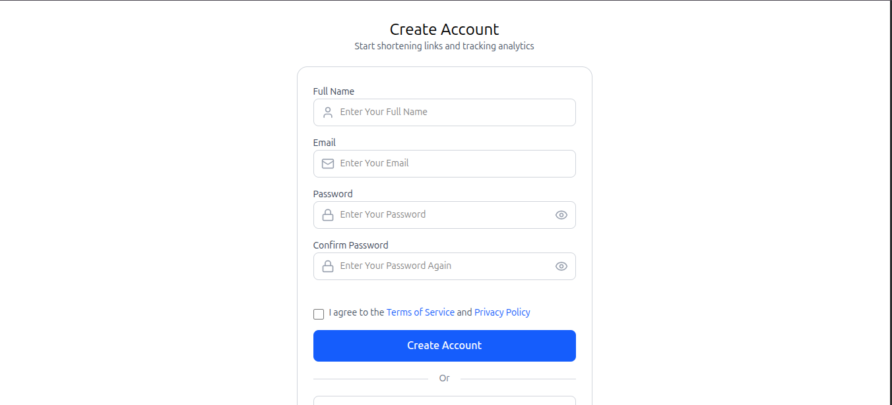
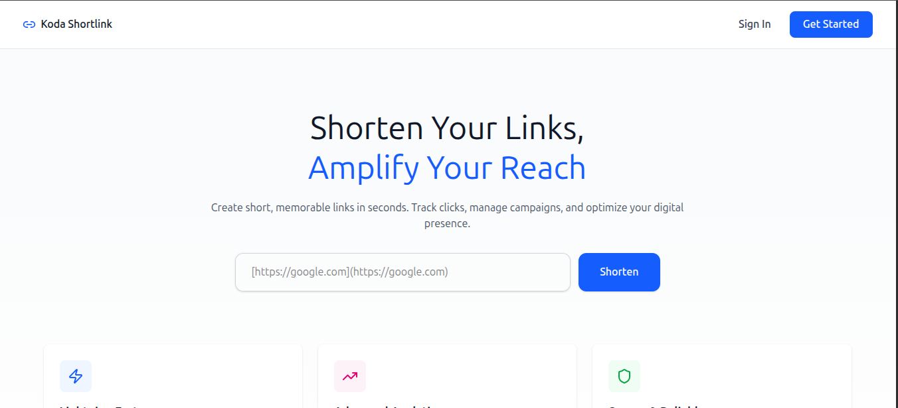
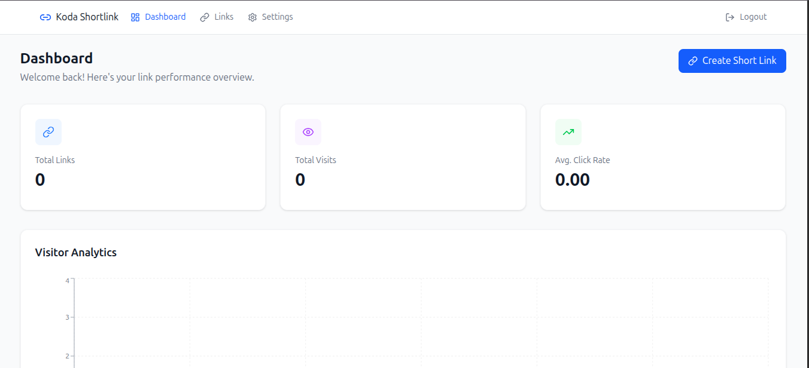
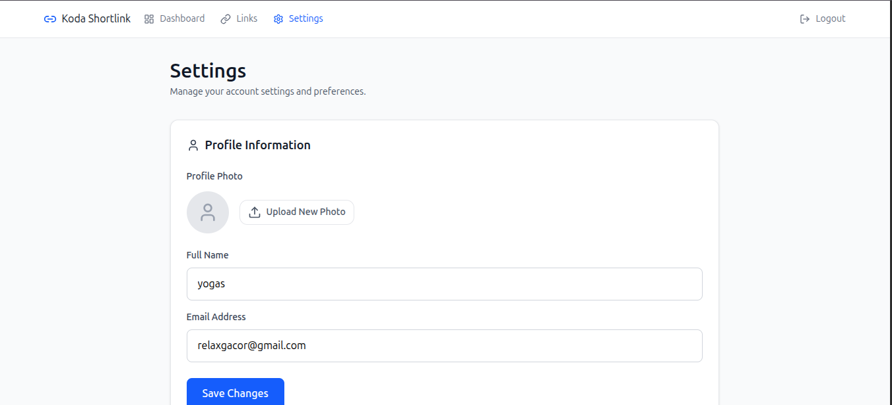
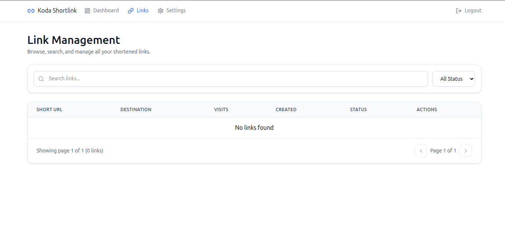

# Shortlink App - Frontend

Aplikasi web frontend untuk shortlink service yang dibangun dengan React dan Tailwind CSS.

## Tech Stack

- **React** - JavaScript library untuk UI
- **Redux** - State management untuk token dan global state
- **Yup** - Schema validation untuk form
- **Tailwind CSS** - Utility-first CSS framework
- **React Router** - Routing
- **Axios** - HTTP client
- **React Hook Form** - Form management (opsional)

## Prasyarat

- Node.js 16.x atau lebih baru
- npm atau yarn
- Backend API sudah berjalan

## Instalasi

1. Clone repository
```bash
git clone <repository-url>
cd <frontend-directory>
```

2. Install dependencies
```bash
npm install
# atau
yarn install
```

3. Setup environment variables
```bash
cp .env.example .env
```


## Cara Menjalankan Frontend

### Development Mode
```bash
npm start
# atau
yarn start
```

Aplikasi akan berjalan di `http://localhost:3000`

### Build untuk Production
```bash
npm run build
# atau
yarn build
```

### Preview Production Build
```bash
npm run serve
# atau
yarn serve
```


## Fitur Utama

### 1. Authentication
- Register user baru
- Login dengan email & password
- Logout
- Protected routes
- Token disimpan di Redux store dan localStorage

### 2. Dashboard
- Lihat semua shortlink yang dibuat
- Create shortlink baru
- Edit shortlink
- Delete shortlink
- Copy shortlink ke clipboard

### 3. Analytics
- Lihat jumlah klik
- Grafik statistik klik
- Informasi browser & device
- Geographic data

### 4. Profile Management
- Update profile
- Change password
- View account settings


## Screenshot Aplikasi









## Testing

### Unit Testing dengan Jest
```bash
npm test
# atau
yarn test
```


## Browser Support

- Chrome (latest)
- Firefox (latest)
- Safari (latest)
- Edge (latest)

## Performance Optimization

- Code splitting dengan React.lazy
- Image optimization
- Memoization dengan useMemo dan useCallback
- Virtual scrolling untuk list panjang
- Lazy loading untuk komponen berat

## Troubleshooting

### CORS Error
- Pastikan backend sudah mengizinkan origin frontend
- Cek konfigurasi CORS di backend

### Token Expired
- Implementasi refresh token mechanism
- Redirect ke login page

### Redux State Not Persisting
- Cek redux-persist configuration
- Clear localStorage jika ada masalah

## Best Practices

1. **Component Organization**: Pisahkan komponen berdasarkan fungsi
2. **State Management**: Gunakan Redux untuk global state, local state untuk UI
3. **Validation**: Selalu validasi input di frontend dan backend
4. **Error Handling**: Tampilkan error message yang user-friendly
5. **Loading States**: Berikan feedback saat data loading
6. **Responsive Design**: Pastikan aplikasi responsive di semua device

## Kontribusi

1. Fork repository
2. Create feature branch (`git checkout -b feature/AmazingFeature`)
3. Commit changes (`git commit -m 'Add some AmazingFeature'`)
4. Push to branch (`git push origin feature/AmazingFeature`)
5. Open Pull Request

## License

[MIT License](LICENSE)

## Contact

Untuk pertanyaan atau dukungan, silakan hubungi [your-email@example.com]